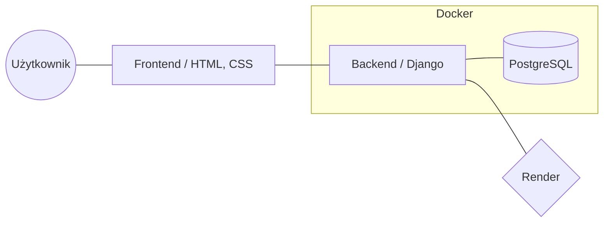
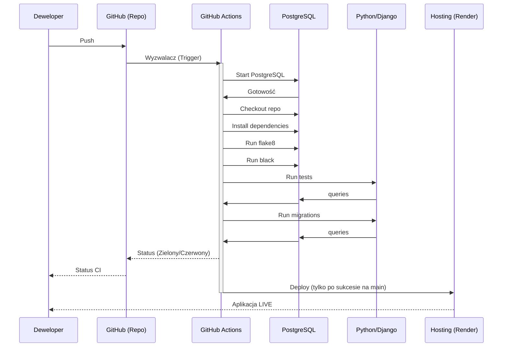

# Raport Końcowy z Projektu
**Przedmiot:** Integracja Systemów Informatycznych  
**Nazwa Projektu:** Kurs elearningowy 
**Skład Zespołu:** Dawid Kasperczyk
**Link do repozytorium:** (https://github.com/DK02-CRT/e-learn)
**Link do wersji LIVE:** (https://e-learn-q2lu.onrender.com/)

---

## 1. Opis Projektu
System ten przedstawia system nauczania, dzięki któremu użytkownicy mogą nauczyć się nowych rzeczy i sprawdzić swoją wiedzę podchodząc do mini sprawdzianu w temacie oraz quizu kursu.

### 1.1. Zakres Funkcjonalny
- [ ] Wyświetlanie danych z bazy danych:
    * [ ] informacje o kursach,
    * [ ] quizach,
    * [ ] użytkownikach,
    * [ ] wynikach,
- [ ] Tworzenie użytkownika,
- [ ] Edycja danych użytkownika,
- [ ] Opcja logowania i wylogowania się użytkownika,
- [ ] Generowanie wyników i statystyk.

## 2. Architektura Systemu
[Opisz architekturę wysokopoziomową aplikacji]

### 2.1. Diagram Architektury


### 2.2. Stos Technologiczny
- **Backend:** - Django
- **Baza danych:** - PostgreSQL
- **Konteneryzacja:** - Docker + Docker Compose

### 2.3. Model Danych (Diagram ERD)
Diagam relacji dla kursu

Diagram reelacji dla quizu


### 2.4. Zgodność z Twelve-Factor App
[Opisz krótko, jak projekt realizuje wybrane zasady 12-factor, np. Config, Backing Services, Statelessness]
- [ ] Codebase - cały projekt znajduje się w repozytorium e_learn
- [ ] Dependencies - wszystkie zależności projektu znajdują się w pliku requirements.txt
- [ ] Config - jest spełniony tylko w main, w pozostałych gałęziach nie 
- [ ] Backing Services - 

## 3. Realizacja CI/CD i Jakość Kodu

### 3.1. Pipeline CI (GitHub Actions)
[Opisz proces automatycznej weryfikacji. Wklej kluczowe fragmenty pliku `.yml`]
```yaml
    services:
      postgres:
        image: postgres:16
        env:
          POSTGRES_DB: ${{ secrets.DB_NAME }}
          POSTGRES_USER: ${{ secrets.DB_USER }}
          POSTGRES_PASSWORD: ${{ secrets.DB_PASSWORD }}
        ports:
          - 5432:5432

        options: >-
          --health-cmd="pg_isready -U elearn_user"
          --health-interval=10s
          --health-timeout=5s
          --health-retries=5

    steps:
      - uses: actions/checkout@v4
      - name: Python
        uses: actions/setup-python@v5
        with: 
          python-version: "3.10"

      - name : Installing dependencies
        run: |
          python -m pip install --upgrade pip
          pip install -r requirements.txt
          pip install flake8
          pip install black

      - name: Run flake8
        run: |
          flake8 . --exclude=venv,__pychache__,migrations --max-line-length=120

      - name: Run black
        run: |
          black . --exclude=venv,__pychache__,migrations --line-length=120

      - name: Running tests
        run: python manage.py test

      - name: Run migrations
        run: python manage.py migrate
```
[Wstaw diagram sekwencji procesu CI/CD]


### 3.2. Testy i Pokrycie Kodu
- **Rodzaje testów:** - Jednostkowe, Integracyjne
- **Narzędzie do pokrycia:** - pytest-cov
- **Wynik pokrycia:** [X]% (dołącz zrzut ekranu z raportu coverage)


### 3.3. Statyczna Analiza Kodu
Użyte lintery - flake8, black

### 3.4. Deployment (CD)
[Opisz proces automatycznego wdrażania na produkcję. Na jakiej platformie?]

## 4. Zarządzanie Projektem i Współpraca
- **Workflow:** GitHub Flow
- **Konwencja Commitów:** [np. Conventional Commits]

## 5. Dokumentacja API
| Metoda | Endpoint | Opis |
| :--- | :--- | :--- |
| GET | `/` | Wyświeltla stronę główną |
| GET | `/courses` | Wyświeltla stronę z dostępnymi kursami |
| GET | `/courses/<nr_modułu>` | Wyświeltla listę tematów wybranego modułu |
| GET | `/courses/<nr_modułu>/<nr_tematu>` | Wyświeltla zawartość tematu z zadaniami |
| POST | `/courses/<nr_modułu>/<nr_tematu>` | Wysyła do serwera dane z formularza z zadaniami i wyświetla wyniki na stronie |
| GET | `/quizes` | Wyświeltla listę quizów |
| GET | `/quizes/<nr_quizu>` | Wyświeltla listę zadań dla wybranego quizu |
| POST | `/quizes/<nr_quizu>` | Wysyła do serwera dane z formularza z zadaniami i wyświetla wyniki na stronie |
| GET | `/results` | Wyświetla wyniki z kursów i quizów oraz statystyki użytkowników |
| GET | `/users/account` | Wyświetla konto użytkownika |
| POST | `/users/account` | Wysyła dane do serwera i zmienia dane użytkownika |
| GET | `/users/signin` | Wyświetla stronę do logowania się |
| GET | `/users/signup` | Wyświetla stronę do rejestracji konta |


## 6. Podsumowanie i Wnioski
- **Główne wyzwania:** [Co było najtrudniejsze?]
- **Udało się zrealizować:** [Z czego jesteście najbardziej dumni?]
- **Plany na rozwój:** [Co byście dodali, mając więcej czasu?]
- **Wnioski z integracji:** [Refleksja na temat integrowania różnych systemów]
